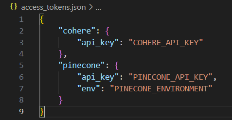
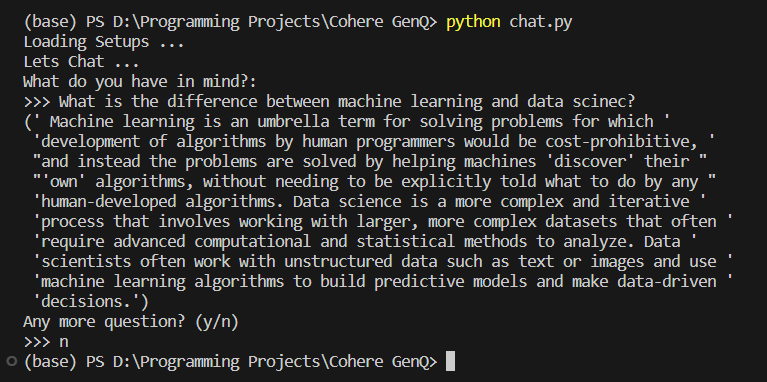

# Cohere GenQ

Generative Question Answering using Coher API

## Introduction

Large Language Models (LLMs) represent a groundbreaking advancement in natural language processing and artificial intelligence. These models are designed to understand, generate, and manipulate human language. Built upon deep learning techniques, LLMs have the ability to comprehend context, semantics, and nuances in text, making them remarkably versatile tools for various applications.

In this dummpy project, we utilize the [Cohere API](https://cohere.com/) to encode web-scapped text and answer questions using them.

## Steps

In this section we will descibe how the project works.

- Extract Wikipedia articles using beautiful soup and split them by paragraph.
- Vectorize (embed/encode) the snippets using the **Cohere Embedding** end point.
- Store the data (text and vectors) in a vector database, here we are using [Pinecone](https://www.pinecone.io/).
- Build the Chat template using the [LangChain](https://github.com/langchain-ai/langchain) **PrompTemplate**.
- Send the question prompt to the **Cohere generation** end point.

## Setups

- Install the [required](requirements.txt) packages using `pip install -r requirements.txt`.
- Create **Cohere** and **Pinecone** account for free and store their API keys.
- Use the following JSON format to store the keys.

- Update the links in the [process](process.py#L101) file to include your prefered topics.
  _Note: The links can be online links or webpages stored locally. Just use the link to the local html webpage `./path/to/file.html`_

- Run the processing script `python process.py` and wait till it creates the index if not present and uploads the data.
- Run the chat script `python chat.py`.

## Example

## Credits

[James Briggs](https://youtube.com/playlist?list=PLIUOU7oqGTLgBf0X_KzRlsqyM2Cs7Dxp9)
